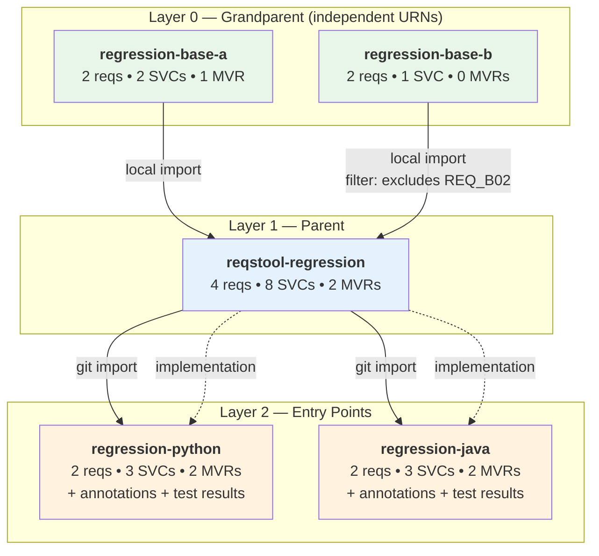
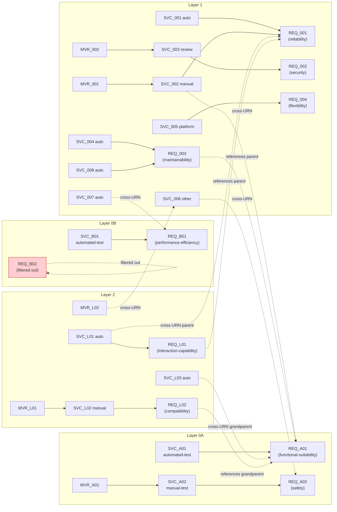
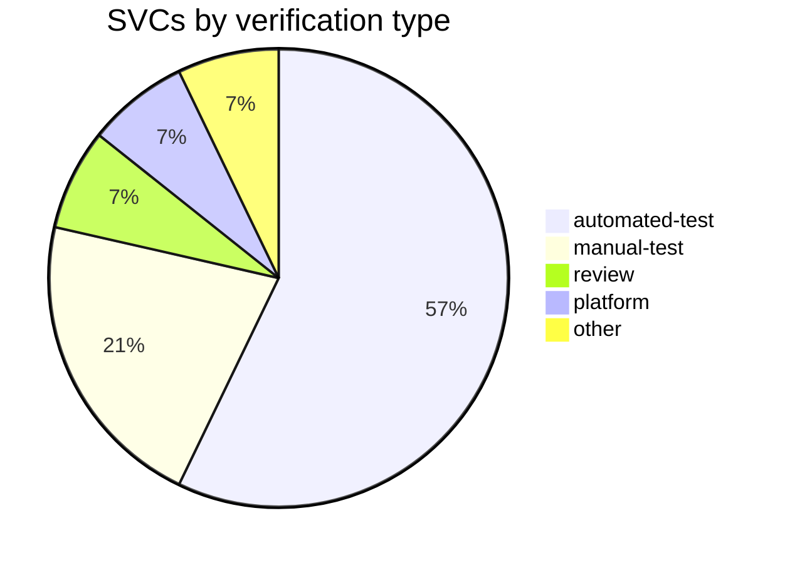
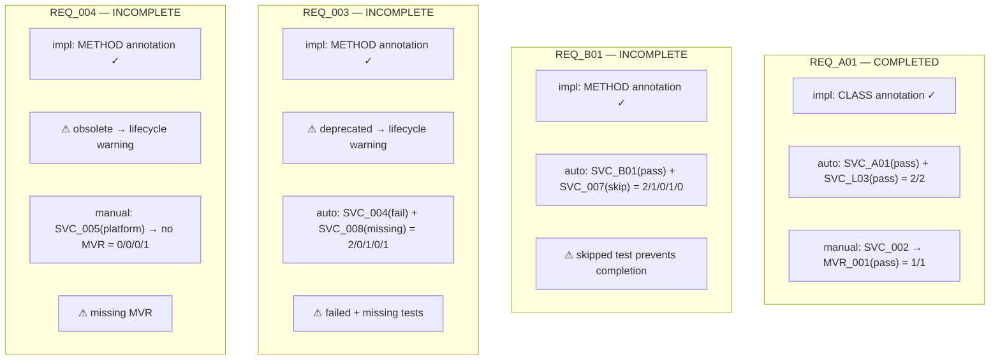

# Regression Test Data Plan

This document describes the architecture and detailed data design for the reqstool regression test repositories.

Related issues:

- [reqstool-client#325](https://github.com/reqstool/reqstool-client/issues/325) -- SSOT requirements repository
- [reqstool-client#326](https://github.com/reqstool/reqstool-client/issues/326) -- Python regression test wrapper
- [reqstool-client#327](https://github.com/reqstool/reqstool-client/issues/327) -- Java regression test wrapper

## Goal

Provide minimal but comprehensive regression test data that exercises **every** code path in reqstool-client's parsing, import chain, statistics computation, and report generation. The data must cover:

- All enum values (significance, lifecycle, categories, implementation, verification types)
- All test outcome states (pass, fail, skip, missing)
- All MVR outcome states (pass, fail, missing)
- Cross-URN references at parent and grandparent depth
- Multiple imports with selective filtering
- Requirements, SVCs, and MVRs at every layer
- Both surefire (unit) and failsafe (integration) test results

## Architecture

### Layer diagram



### Repository layout

```
reqstool-regression/              <-- this repo
  base-a/
    requirements.yml              (URN: regression-base-a)
    software_verification_cases.yml
    manual_verification_results.yml
  base-b/
    requirements.yml              (URN: regression-base-b)
    software_verification_cases.yml
  requirements.yml                (URN: reqstool-regression, imports base-a + base-b, implements python + java)
  software_verification_cases.yml
  manual_verification_results.yml

reqstool-regression-python/       <-- separate repo
  requirements.yml                (URN: regression-python, imports reqstool-regression via git)
  software_verification_cases.yml
  manual_verification_results.yml
  annotations.yml
  reqstool_config.yml
  test_results/
    surefire/TEST-test_svcs.xml
    failsafe/TEST-test_svcs_it.xml
  src/
    requirements_example.py
    test_svcs.py

reqstool-regression-java/         <-- separate repo (mirrors Python with Java artifacts)
```

### Entry points

| Entry point | Layers traversed | What it tests |
|-------------|-----------------|---------------|
| `base-a/` | L0A only | Basic req + SVC + MVR parsing in isolation |
| `base-b/` | L0B only | Basic parsing, no MVRs |
| `reqstool-regression/` (root) | L1 + L0A + L0B + L2 (via impl) | Multi-import, filters, MVRs, implementation chain pulling L2 annotations/test results |
| `regression-python/` | L2 + L1 + L0A + L0B | Full chain: git import, annotations, tests, cross-URN refs |

### Why multiple URNs at Layer 0?

1. **Multiple imports** -- Layer 1 imports both A and B, testing `imports: local: [{path: ./base-a}, {path: ./base-b}]`
2. **Selective filtering** -- Layer 1 filters a requirement from B but not from A
3. **Cross-URN SVC references across import sources** -- Layer 1 SVCs reference reqs from both A and B
4. **Matches existing test patterns** -- mirrors the `sys-001 -> ext-001 + ext-002` fixture in reqstool-client

A and B are independent and unaware of each other.

### Two-phase traversal

reqstool uses a two-phase traversal model. Both phases are configured in `requirements.yml`:

1. **Import chain** (Phase 1, `imports:`) -- child pulls parent's requirements, SVCs, and MVRs. Arrows flow upward: L2 imports L1, L1 imports L0.
2. **Implementation chain** (Phase 2, `implementations:`) -- parent declares implementation children that provide annotations, test results, and their own MVRs. Arrows flow downward: L1 declares L2 wrappers as implementations.

This means Layer 1 (`reqstool-regression`) has both `imports:` (pointing to L0A, L0B) and `implementations:` (pointing to `regression-python`, `regression-java`). When reqstool enters at Layer 1, Phase 2 follows the implementation chain to collect annotations and test results from the language wrappers.

---

## Detailed Data Design

### Layer 0A: `regression-base-a`

#### Requirements (2)

| ID | Significance | Lifecycle | Implementation | Category | References |
|----|-------------|-----------|---------------|----------|------------|
| REQ_A01 | shall | effective | in-code | functional-suitability | -- |
| REQ_A02 | should | effective | N/A | safety | -- |

#### SVCs (2)

| ID | Verification | Requirement IDs | Lifecycle |
|----|-------------|-----------------|-----------|
| SVC_A01 | automated-test | [REQ_A01] | effective |
| SVC_A02 | manual-test | [REQ_A02] | effective |

#### MVRs (1)

| ID | SVC IDs | Pass | Comment |
|----|---------|------|---------|
| MVR_A01 | [SVC_A02] | true | Verified at base layer |

---

### Layer 0B: `regression-base-b`

#### Requirements (2)

| ID | Significance | Lifecycle | Implementation | Category | References |
|----|-------------|-----------|---------------|----------|------------|
| REQ_B01 | may | effective | in-code | performance-efficiency | -- |
| REQ_B02 | shall | effective | in-code | _(not visible -- filtered)_ | -- |

#### SVCs (1)

| ID | Verification | Requirement IDs | Lifecycle |
|----|-------------|-----------------|-----------|
| SVC_B01 | automated-test | [REQ_B01] | effective |

#### MVRs

None.

---

### Layer 1: `reqstool-regression`

#### Import and implementation configuration

```yaml
imports:
  local:
    - path: ./base-a
    - path: ./base-b

implementations:
  git:
    - url: https://github.com/reqstool/reqstool-regression-python.git
      branch: main
    - url: https://github.com/reqstool/reqstool-regression-java.git
      branch: main

filters:
  regression-base-b:
    requirement_ids:
      excludes:
        - REQ_B02
```

The `implementations:` section enables Phase 2 traversal -- when reqstool enters at Layer 1, it follows these pointers to collect annotations, test results, and MVRs from the language wrappers.

#### Requirements (4)

| ID | Significance | Lifecycle | Implementation | Category | References |
|----|-------------|-----------|---------------|----------|------------|
| REQ_001 | shall | effective | in-code | reliability | -- |
| REQ_002 | may | draft | N/A | security | -- |
| REQ_003 | should | deprecated | in-code | maintainability | [regression-base-a:REQ_A01] |
| REQ_004 | shall | obsolete | in-code | flexibility | -- |

#### SVCs (8)

| ID | Verification | Requirement IDs | Lifecycle | Expected outcome |
|----|-------------|-----------------|-----------|-----------------|
| SVC_001 | automated-test | [REQ_001] | effective | PASS (surefire + failsafe) |
| SVC_002 | manual-test | [REQ_001, **regression-base-a:REQ_A01**] | effective | MVR_001 pass |
| SVC_003 | review | [REQ_002] | effective | MVR_002 **fail** |
| SVC_004 | automated-test | [REQ_003] | **deprecated** | **FAIL** |
| SVC_005 | platform | [REQ_004] | **obsolete** | **No MVR** (missing) |
| SVC_006 | other | [**regression-base-a:REQ_A02**] | effective | MVR_L02 pass (from L2) |
| SVC_007 | automated-test | [**regression-base-b:REQ_B01**] | effective | **SKIP** |
| SVC_008 | automated-test | [REQ_003] | effective | **MISSING** test |

#### MVRs (2)

| ID | SVC IDs | Pass | Comment |
|----|---------|------|---------|
| MVR_001 | [SVC_002] | true | Manual-test pass for REQ_001 |
| MVR_002 | [SVC_003] | false | Review fail for REQ_002 |

---

### Layer 2: `regression-python`

#### Import configuration

```yaml
imports:
  git:
    - url: https://github.com/reqstool/reqstool-regression.git
      branch: main
```

#### Requirements (2)

| ID | Significance | Lifecycle | Implementation | Category | References |
|----|-------------|-----------|---------------|----------|------------|
| REQ_L01 | should | effective | in-code | interaction-capability | [**reqstool-regression:REQ_001**] |
| REQ_L02 | may | effective | N/A | compatibility | [**regression-base-a:REQ_A01**] |

#### SVCs (3)

| ID | Verification | Requirement IDs | Lifecycle |
|----|-------------|-----------------|-----------|
| SVC_L01 | automated-test | [REQ_L01, **reqstool-regression:REQ_001**] | effective |
| SVC_L02 | manual-test | [REQ_L02] | effective |
| SVC_L03 | automated-test | [**regression-base-a:REQ_A01**] | effective |

#### MVRs (2)

| ID | SVC IDs | Pass | Comment |
|----|---------|------|---------|
| MVR_L01 | [SVC_L02] | true | Manual-test pass for REQ_L02 |
| MVR_L02 | [**reqstool-regression:SVC_006**] | true | Cross-URN MVR for parent SVC |

#### Annotations (implementations)

| Requirement | Element Kind | Fully Qualified Name |
|-------------|-------------|----------------------|
| regression-base-a:REQ_A01 | **CLASS** | requirements_example.RequirementsExample |
| regression-base-b:REQ_B01 | METHOD | requirements_example.RequirementsExample.measure_perf |
| reqstool-regression:REQ_001 | METHOD | requirements_example.RequirementsExample.check_reliability |
| reqstool-regression:REQ_003 | METHOD | requirements_example.RequirementsExample.validate_security |
| reqstool-regression:REQ_004 | METHOD | requirements_example.RequirementsExample.maintain_legacy |
| REQ_L01 | METHOD | requirements_example.RequirementsExample.interact |

N/A requirements (REQ_A02, REQ_002, REQ_L02) have no implementation annotations.

#### Annotations (tests)

| SVC | Element Kind | Fully Qualified Name | Test result |
|-----|-------------|----------------------|-------------|
| regression-base-a:SVC_A01 | METHOD | test_svcs.test_base_functional | PASS |
| regression-base-b:SVC_B01 | METHOD | test_svcs.test_base_perf | PASS |
| reqstool-regression:SVC_001 | METHOD | test_svcs.test_reliability | PASS |
| reqstool-regression:SVC_001 | METHOD | test_svcs_it.test_reliability_integration | PASS (failsafe) |
| reqstool-regression:SVC_004 | METHOD | test_svcs.test_security | **FAIL** |
| reqstool-regression:SVC_007 | METHOD | test_svcs.test_perf_skip | **SKIP** |
| reqstool-regression:SVC_008 | METHOD | test_svcs.test_security_audit | **MISSING** |
| SVC_L01 | METHOD | test_svcs.test_interaction | PASS |
| SVC_L03 | METHOD | test_svcs.test_grandparent_verify | PASS |

#### Test results

**surefire/TEST-test_svcs.xml** (7 test methods):

| Method | Classname | Status |
|--------|-----------|--------|
| test_base_functional | test_svcs | passed |
| test_base_perf | test_svcs | passed |
| test_reliability | test_svcs | passed |
| test_security | test_svcs | **failed** |
| test_perf_skip | test_svcs | **skipped** |
| test_interaction | test_svcs | passed |
| test_grandparent_verify | test_svcs | passed |

**failsafe/TEST-test_svcs_it.xml** (1 test method):

| Method | Classname | Status |
|--------|-----------|--------|
| test_reliability_integration | test_svcs_it | passed |

`test_security_audit` is annotated for SVC_008 but intentionally absent from all XML files, producing a MISSING status.

#### reqstool_config.yml

```yaml
language: python
build: hatch
resources:
  test_results:
    - test_results/**/*.xml
```

---

## Cross-URN Reference Map



## Verification Type Distribution



---

## Expected Status Output

When running `reqstool status` from `regression-python`:

| # | Requirement | URN | Sig | Lifecycle | Impl | Auto T/P/F/S/M | Manual T/P/F/M | Completed | Failure reason |
|---|------------|-----|-----|-----------|------|-----------------|----------------|-----------|---------------|
| 1 | REQ_A01 | regression-base-a | shall | effective | in-code | 2/2/0/0/0 | 1/1/0/0 | Yes | -- |
| 2 | REQ_A02 | regression-base-a | should | effective | N/A | N/A | 2/2/0/0 | Yes | -- |
| 3 | REQ_B01 | regression-base-b | may | effective | in-code | 2/1/0/1/0 | N/A | **No** | skip |
| 4 | REQ_001 | reqstool-regression | shall | effective | in-code | 3/3/0/0/0 | 1/1/0/0 | Yes | -- |
| 5 | REQ_002 | reqstool-regression | may | draft | N/A | N/A | 1/0/1/0 | **No** | MVR fail |
| 6 | REQ_003 | reqstool-regression | should | deprecated | in-code | 2/0/1/0/1 | N/A | **No** | fail + missing |
| 7 | REQ_004 | reqstool-regression | shall | obsolete | in-code | N/A | 0/0/0/1 | **No** | missing MVR |
| 8 | REQ_L01 | regression-python | should | effective | in-code | 1/1/0/0/0 | N/A | Yes | -- |
| 9 | REQ_L02 | regression-python | may | effective | N/A | N/A | 1/1/0/0 | Yes | -- |

REQ_B02 excluded by import filter -- not in output.

**Totals**: 9 visible requirements, 5 completed, 4 incomplete. Exit code: **4**.

### Status computation breakdown



---

## Enum Coverage Matrix

### Significance

| Value | Requirements |
|-------|-------------|
| shall | REQ_A01, REQ_B02 _(filtered)_, REQ_001, REQ_004 |
| should | REQ_A02, REQ_003, REQ_L01 |
| may | REQ_B01, REQ_002, REQ_L02 |

### Lifecycle

| Value | Requirements | SVCs |
|-------|-------------|------|
| effective | REQ_A01, REQ_A02, REQ_B01, REQ_B02, REQ_001, REQ_L01, REQ_L02 | SVC_A01, SVC_A02, SVC_B01, SVC_001, SVC_002, SVC_003, SVC_006, SVC_007, SVC_008, SVC_L01, SVC_L02, SVC_L03 |
| draft | REQ_002 | -- |
| deprecated | REQ_003 | SVC_004 |
| obsolete | REQ_004 | SVC_005 |

### Categories (all 9 as primary, each on a distinct visible requirement)

| Category | Requirement |
|----------|------------|
| functional-suitability | REQ_A01 |
| safety | REQ_A02 |
| performance-efficiency | REQ_B01 |
| reliability | REQ_001 |
| security | REQ_002 |
| maintainability | REQ_003 |
| flexibility | REQ_004 |
| interaction-capability | REQ_L01 |
| compatibility | REQ_L02 |

### Implementation type

| Value | Requirements |
|-------|-------------|
| in-code | REQ_A01, REQ_B01, REQ_B02, REQ_001, REQ_003, REQ_004, REQ_L01 |
| N/A | REQ_A02, REQ_002, REQ_L02 |

### Verification type

| Value | SVCs |
|-------|------|
| automated-test | SVC_A01, SVC_B01, SVC_001, SVC_004, SVC_007, SVC_008, SVC_L01, SVC_L03 |
| manual-test | SVC_A02, SVC_002, SVC_L02 |
| review | SVC_003 |
| platform | SVC_005 |
| other | SVC_006 |

### Test result statuses

| Status | Where |
|--------|-------|
| passed | SVC_A01, SVC_B01, SVC_001 (x2), SVC_L01, SVC_L03 |
| failed | SVC_004 |
| skipped | SVC_007 |
| missing | SVC_008 (annotated but no XML match) |

### MVR outcomes

| Outcome | Where |
|---------|-------|
| pass | MVR_A01, MVR_001, MVR_L01, MVR_L02 |
| fail | MVR_002 |
| missing | SVC_005 (platform, no MVR exists) |

---

## Lifecycle Warnings

| Item | State | Warning trigger |
|------|-------|-----------------|
| REQ_003 | deprecated | Has implementation annotation in L2 |
| REQ_004 | obsolete | Has implementation annotation in L2 |
| SVC_004 | deprecated | Has test annotation in L2 |
| SVC_005 | obsolete | Exists with no verification (missing MVR) |

---

## Java Wrapper

`regression-java` mirrors `regression-python` exactly in structure:

- Same 2 local requirements (REQ_L01, REQ_L02) with identical properties
- Same 3 local SVCs (SVC_L01, SVC_L02, SVC_L03) with identical verification types and cross-URN references
- Same 2 MVRs (MVR_L01, MVR_L02)
- Java FQNs: `com.reqstool.regression.RequirementsExample.*` / `com.reqstool.regression.SVCsTest.*`
- Maven surefire/failsafe XML format with identical test outcomes
- Expected exit code: **4** (same as Python)

#### reqstool_config.yml

```yaml
language: java
build: maven
resources:
  test_results:
    - test_results/**/*.xml
```

---

## Verification Commands

```bash
# Entry point 1: base-a in isolation
reqstool status local -p base-a
# Expected: 2 reqs, 0 completed (no annotations/test results), exit code 2

# Entry point 2: base-b in isolation
reqstool status local -p base-b
# Expected: 2 reqs, 0 completed, exit code 2

# Entry point 3: reqstool-regression root (with implementations)
reqstool status local -p .
# Expected: 7 visible reqs (REQ_B02 filtered, no L2 reqs)
# Implementation chain pulls annotations + test results from L2 wrappers

# Entry point 4: regression-python (full chain)
reqstool status local -p <path-to-regression-python>
# Expected: 9 reqs, 5 completed, 4 incomplete, exit code 4

# Report with category grouping
reqstool report --format markdown --group-by category local -p <path-to-regression-python>
# Expected: all 9 categories as group headers

# Report with initial/imports grouping
reqstool report --format markdown --group-by initial local -p <path-to-regression-python>
# Expected: "regression-python (2)" initial + "Imported (7)" group
```
